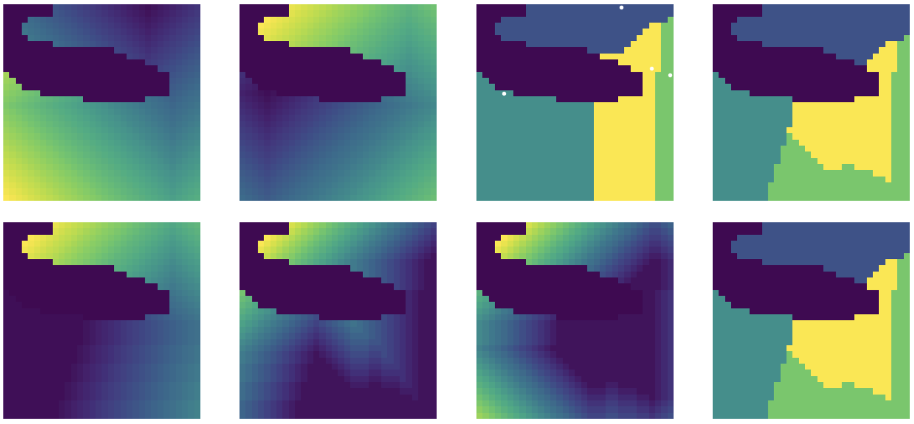
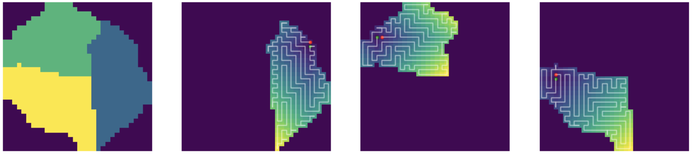
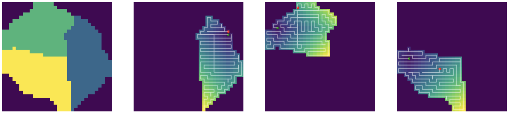
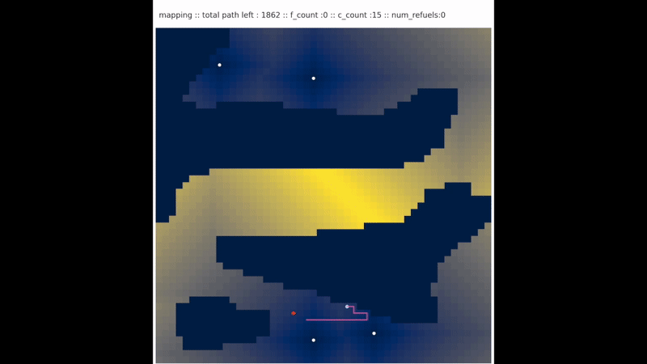
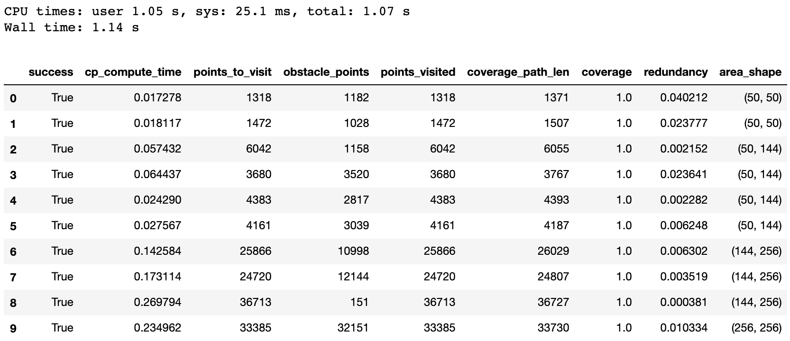
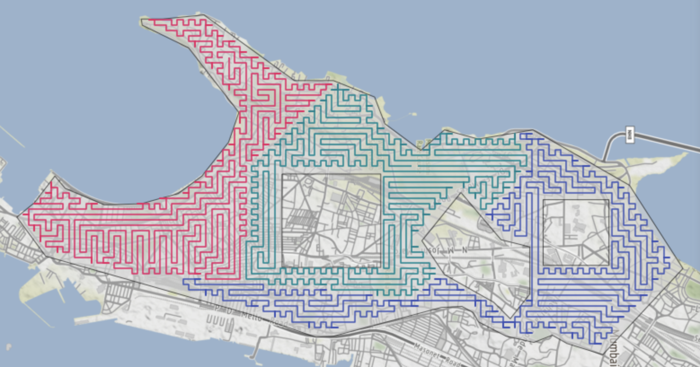

# Coverage Path Planning
Contains python implementations of various algorithms used for coverage path planning and one for area division used in mCPP.

## DARP - Area Division
DARP : Divide Areas Algorithm for Optimal Multi-Robot Coverage Path, is an equal area division algorithm for multiple robot coverage paths.

- DARP visualization on a test area map.
- Left most images are area maps that have roughly the same number of assigned cells. 
- Point gradients are traversable $L_1$ distance based.
- Region gradients pertain to the computation of the $C_i$ matrix as given in the paper.

[Image source notebook](./test_notebooks/DARPTests.ipynb). [Preprint](http://kapoutsis.info/wp-content/uploads/2017/02/j3.pdf) and [Repository](https://github.com/athakapo/DARP).

---
## Coverage Path Planning
- Gradients are created from the starting points.
- Green points are the start points, red are the end points and white is the coverage path.
- [Images source notebook](./DARPWithCPPAlgos.ipynb).
### Spanning Tree Coverage
Creates a minimum spanning tree from the given area for generation of the coverage path.
STC is run individually on the sub regions.

### Boustrophedon
An online algorithm that uses A* to get to the next starting point.
Boustrophedon is run individually on the sub regions.

### Wavefront
An algorithm that uses a distance to central point based gradient to traverse the region.
Waverfront is run individually on the sub regions.

---

## Other Stuff

### Fuelling Algo   
Uses the shortest L1 path to get to the fuel point from a point in the coverage path that minimizes the residual fuel. The Pink 
- Pink path is the coverage path, light blue is the fuelling path.
- Yellow is the start point and red is the end point.
- The algorithm displayed is STC.
- [Animation source notebook](./test_maps/CPPTests.ipynb), [algo notebook](./ShortestL1Fuelling.ipynb).

### Tests
Tests on the CPP and Fuelling algos with metrics are [here](./test_notebooks/CPPTests.ipynb).

### Running on Shapefiles
The Area division and coverage path algorithms were run on shapefiles pertaining to actual areas but reprojection of the generated path is (highly) inaccurate.

The rasteriszed map with the path overlay.

The shapefile on a map tile with the reprojected path as an overlay.

More [here](./DARPShapefiles.ipynb) (execrable reprojections, pls hlp).

---

**Should Do**
- Fix issue with DARP.
- Fix reprojections.
- Add latest optimizaiton of STC.

